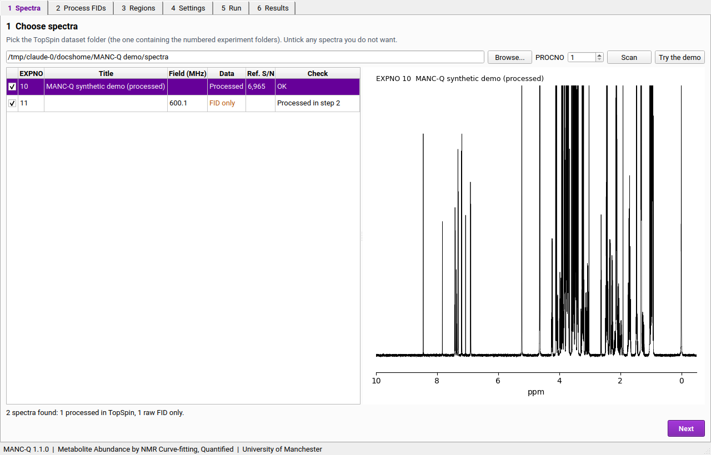
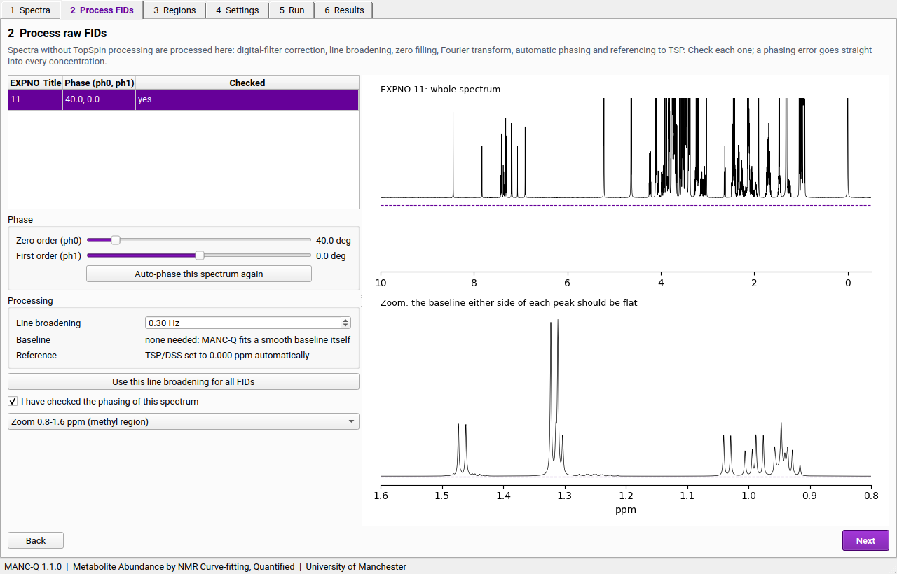
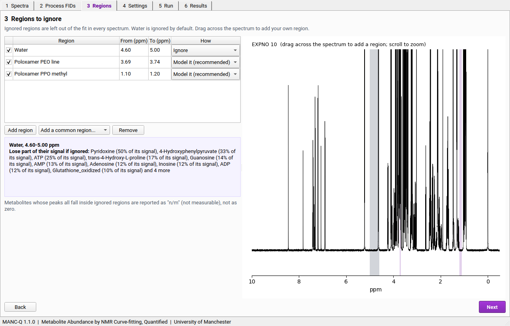
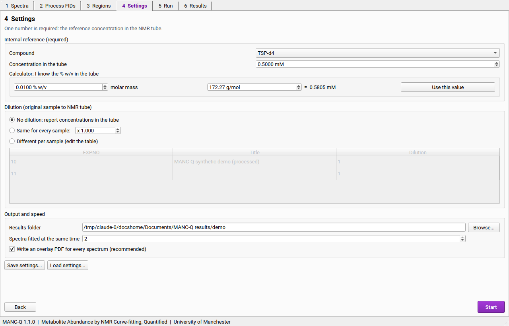
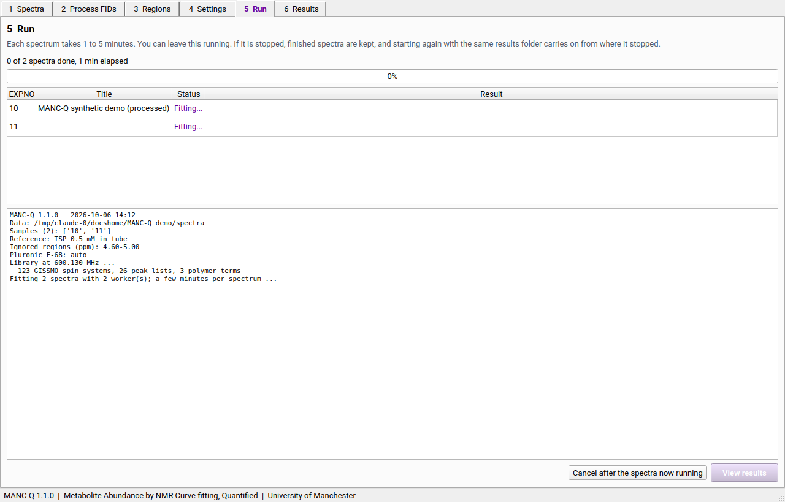
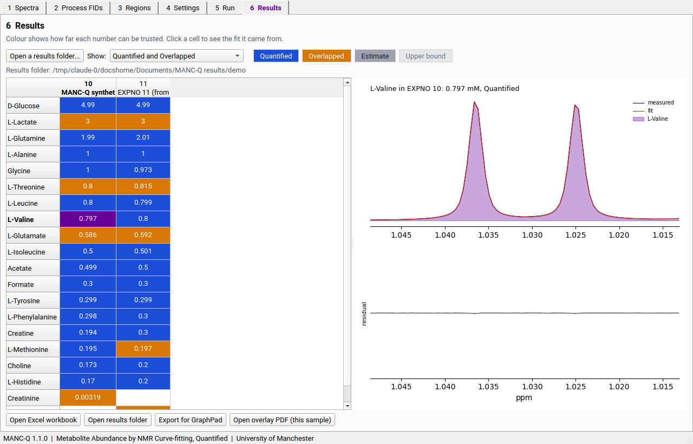
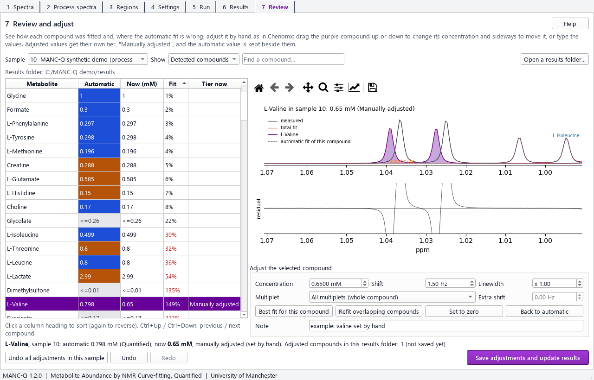

# MANC-Q quick start (graphical interface)

You need: a folder of Bruker 1D ¹H experiments (processed in TopSpin, or raw FIDs), and the TSP (or DSS)
concentration in the NMR tube. A run takes 1 to 5 minutes per spectrum.

**Start MANC-Q** from the Start menu (if you used the installer), or double-click MANC-Q.bat in the MANC-Q folder (or its desktop shortcut).

Every step has a **Help** button (top right) that shows its part of this guide. MANC-Q remembers your last
dataset folder, reference concentration, dilution, regions and other settings for next time; check them before
each run. (They are kept in `window_settings.json` in your AppData\MANC-Q folder; delete it to start afresh.)

## 1 Spectra

Click **Browse...** and choose the TopSpin dataset folder (the one that contains the numbered experiment
folders). Every experiment is listed. Untick any you do not want. The **Check** column flags spectra with a
weak or broad reference peak; click a row to see the spectrum. To compare spectra, select several rows (hold
Ctrl or Shift and click): they are drawn on top of each other, each divided by its reference peak (untick
**Scale to the reference peak** to see the raw intensities). Scroll over the plot to zoom.

First time? **Try the demo** makes two synthetic spectra (one processed, one raw FID) with known concentrations to practise on.

## 2 Process spectra

Every spectrum is listed. **Spectra processed in TopSpin** are used exactly as TopSpin processed them, as long
as **Use TopSpin's processing as is** stays ticked (the usual choice). To change one, untick it: the phase
sliders then show the *change* from TopSpin's phase (0 = TopSpin's), and the line broadening you set replaces
TopSpin's (TopSpin's value is shown next to it). The grey trace is TopSpin's spectrum, for comparison.
MANC-Q needs TopSpin's imaginary part (`1i`) or the raw FID to do this; if both are missing the spectrum can
only be used as it is.

**Raw FIDs** are processed and phased automatically. For each one, look at the zoomed view: the baseline either
side of the peaks should be flat, with no dips below the dashed line. If it is not, move the **ph0** slider
until it is.

To fine-tune the phase, click a slider and use the arrow keys (0.1 degree steps; Page Up / Page Down for 1
degree). **Auto-phase all raw FIDs** phases every FID automatically in one go.

Tick **I have checked the processing** for every spectrum MANC-Q processes (**Mark all as checked** does it for
all of them, once you have looked at each). Phasing errors change
concentrations, so do not skip this. **Baseline correction** is off by default: MANC-Q fits a smooth baseline
itself, and an extra correction can distort broad signals. The settings used are saved in the results folder
(`processing_used.csv`), so a run can be repeated exactly, also from the command line.

## 3 Regions

Regions left out of the fit. Water is ignored by default. If your medium contains poloxamer (Pluronic F-68),
leave it on **Model it**. To ignore anything else, drag across the spectrum or use **Add a common region**.
The purple box tells you which metabolites lose signal in the selected region.

## 4 Settings

Enter the **reference concentration in the tube** (the calculator converts % w/v), the **dilution** from your
original sample to the tube (or "No dilution" for tube concentrations), and check the results folder.
**CPU cores to use** sets how many spectra are fitted at the same time (one per core; the default is all but
one). Fewer cores leave the PC free for other work; more cores only help when there are several spectra. With
**Tell me when a run finishes** ticked, Windows shows a notification and plays a sound at the end of a run.
Click **Start**.

## 5 Run

Progress for each spectrum and the time remaining (also shown in the window title, so you can see it while
working in another program). You can cancel; finished spectra are kept.

## 6 Results

Each value is coloured by how far it can be trusted:

| Colour | Meaning | Use |
|---|---|---|
| Blue | Quantified | a measurement |
| Orange | Overlapped | semi-quantitative; good for trends |
| Grey (`~`) | Deconvolution estimate | an estimate only |
| Teal | Manually adjusted | set by hand in step 7; the automatic value is kept alongside |
| Pale grey (`<=`) | Upper bound | the most it can be; not a measurement |
| `<LOD` / `n/m` | not detected / not measurable (region ignored) | |

Click any value to see the fit it came from; double-click it (or click **Review and adjust this fit**) to
open it in step 7. **Open Excel workbook** gives every table; **Export for GraphPad** writes samples x
metabolites with only the values you chose to show.

* **Copy:** select cells and press **Ctrl+C** to copy them as shown, with metabolite and sample names, ready to
  paste into Excel. Right-click and choose **Copy numbers only** to get plain numbers (blank where there is no
  reportable value), for Prism or calculations.
* **The plot on the right** has two pairs of buttons. **This metabolite** zooms to the selected metabolite and
  **Whole spectrum** shows the whole spectrum, with the metabolite filled in purple and arrows over its peaks.
  **Peak** picks which of its peaks to zoom to (the main one, all of them, or any single one). Turn the mouse
  wheel over the plot to zoom in and out; the toolbar above it has a magnifier (drag a box to zoom), cross
  arrows (move around) and a house (back to the start).
* **2D spectra (TOCSY, COSY):** click **2D** to see the 2D spectrum of the same sample. MANC-Q finds it by
  itself: a processed 2D experiment (`pdata/1/2rr`) in the same data folder with the same title, nearest in
  EXPNO. If the nearest 2D has a different title, it is still shown but with a red warning, because it may be a
  different sample; **Choose 2D spectrum...** picks the right EXPNO folder by hand (remembered in the results
  folder). The 2D is moved so that its TSP peak is at 0 ppm, like the 1D. Circles mark the cross peaks the
  metabolite should give (protons coupled to each other in its library spin system, at the positions fitted in
  the 1D): **green = seen** (a real peak top there, at least 10 x the 2D noise), **red = missing**. The 1D with
  the metabolite in purple is drawn above the 2D. **Contours from** sets the lowest contour level (raise it if
  the plot is crowded). **2D check of all metabolites...** lists every metabolite of the sample with how many of
  its expected cross peaks are seen, and can save that as `twod_check_sample_<EXPNO>.csv`. The 2D is a check of
  identity only: it never changes a value. Seen cross peaks support an assignment; missing ones on a strong
  metabolite deserve a look; weak metabolites may simply be too weak for the 2D. Compounds from fixed peak
  lists and singlets (for example formate, acetate) have no cross peaks to check.
* **Save this plot...** saves the plot on the right as PNG (300 dpi), SVG (editable) or PDF.
* **Recent results...** reopens results folders you looked at before.

## 7 Review and adjust (optional)

This works like Chenomx. Pick a **sample**, then a compound in the list (**Show** chooses detected, all, or
adjusted compounds; type in the box to find one). The plot shows the measured spectrum (black), the total fit
(red), the selected compound (purple), its neighbours (thin coloured lines) and, below, what is left over
(the residual). Scroll over the plot to zoom; the toolbar above it can pan and zoom too.

The **Fit** column says how far the measured spectrum differs from the fit around each compound's peaks, as a
share of the compound's own signal (lower is better; above 25 % is shown in red). Click any column heading to
sort by it, as in File Explorer, and click again to reverse: sorting **Fit** with the worst first is the
quickest way to find the compounds worth checking. **Ctrl+Down** and **Ctrl+Up** move to the next and previous
compound in the list.

To adjust the selected compound:

* **Drag it** with the mouse: up or down changes the concentration, sideways moves it. Or type the
  **Concentration**, **Shift** (Hz) and **Linewidth** (a factor; 1 = as fitted).
* Choose one **Multiplet** to zoom to it and give it an **Extra shift** of its own (useful for pH-sensitive
  compounds).
* **Best fit for this compound** finds the concentration, shift and linewidth that best match the data around
  its peaks, keeping everything else as it is.
* **Refit overlapping compounds** keeps this compound as it is and refits the compounds under its peaks. You
  see the changes before they are applied; those compounds are marked as adjusted too.
* **Set to zero** if the compound is not in the sample; **Back to automatic** removes the adjustment.
* Write a **Note** saying why. It is saved with the result, with your user name and the time.
* **Undo** (Ctrl+Z) and **Redo** (Ctrl+Y) step back and forward through your adjustments; a drag or a run of
  typing on one compound counts as one step.

The dashed grey line shows the automatic fit of the compound, so you can see what you changed. Nothing is
changed until you click **Save adjustments and update results**: the workbook, tables, overlay PDFs and step 6
are then rewritten (in seconds, nothing is refitted). Adjusted values have the tier **Manually adjusted**; the
automatic tier and value stay in the `Long_table` sheet (columns `auto_tier`, `auto_conc_mM`), and every change
is listed in the `Manual_edits` sheet. If a spectrum is fitted again later, its adjustments are set aside
because they refer to the earlier fit.
